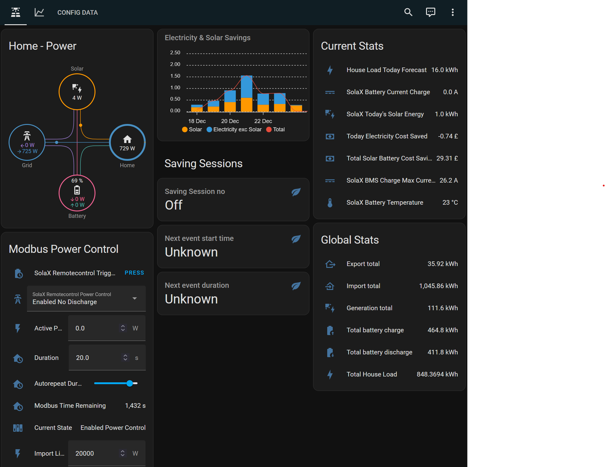

# Solax X1 & X3 Hybrid G4 Inverters
The Solax X1 & X3 Hybrid G4 inverters are significantly different from other versions that a new section with modified code base was required. 

The modified code contained within this section closely follows the work done originally by Jev and as closely as possible matches his theory on battery automation. 

***This code has been tested on the X1 Hybrid G4 inverter.***

## Notable differences and deviations

- Dashboard modified for Hybrid entities.  Additional configuration options added
- There is no solax entity to control "Timed Charge Current", therefore charging logic has been modified and additional helpers added as a workaround
- No solax entity for "house load today".  This is used in many calculation.  A template has been added to provide an approximated value for this.
- Timed charge windows have to be set in 15 minute intervals, this has necessitated rounding of the calculated charge end time.  
- Forced Discharging can not be set on schedule.  To force discharge a batteries with Hybrid inverters, it is required to set the inverter to manual mode.  The automations have been updated to do this.
- Changes made to any solax modbus entity are sent to the inverter in real-time, so automations to update inverter times have been removed.

### Changes to Automations

- **Flux - Charge:** This now sets the charge window to 1 hour  
- **Flux - Charge Cutout:** New automation to cut out charging when battery reaches Flux Charge SoC (new helper, value can be set in dashboard)
- **Flux - Discharge Cutout:** New helper and dashboard configuration entry added to set flux discharge cutout SoC rather than hard coded value. Logic changed to switch inverter back to "Self Use" mode
- **Flux - Discharge:** Logic change to set inverter to "manual mode"
- **Solar - Battery Charging Automation:** End time rounded to nearest 15 minutes. Maximum drift from calculated charge time is +/- 8 minutes

### Installation

#### UI Based Installation
>Five files exist here - code for your Home Assistant dashboard (full or minimalist variants), code for Template Sensors (config.yaml), code for Automations and definitions for Helpers.  Instructions on where to copy & paste exist within each repo file.

#### File Based Installation
>YAML files are provided in the [Code](Code) directory.  Please read and follow the [Readme](Code/Readme.md) file within.

You must install HACS integrations and frontend as specified in the repo files.

Required HA integrations for this to work are [Solax Modbus](https://github.com/wills106/homeassistant-solax-modbus) and [Solcast](https://toolkit.solcast.com.au/register/hobbyist) (configured to your existing system).

## Full Dashboard

Here is what the [Full Dashboard](https://github.com/jevburchell/Solis-Modbus-Auto-Charging-using-Solax/blob/main/Dashboard%20(Full).md) looks like:

# User Guide
## UI
### Solar Data

Split into three sections in the dashboard is your live solar data, taken directly from your inverter using your Modbus interface and polled into Home Assistant at whatever rate you set using the Solax Integration.  I find 30 seconds works well and displays nicely in the graphs without using up too much disk space on my instance, and is not too processor-intensive.  Colours can be chosen to suit your needs easily.  Graphs are drawn using Apex Charts.

* Battery - Soc, Daily Charge Amount and Daily Discharge Amount.

* Inverter - Real-time House Load, Daily Consumption, Daily Export and Daily Import.

* Panels - Combined Output, String 1 and String 2.  (You may want to delete string 2 and the combined output if they are not required on your system).
-----
### Main Controls

This is the heart of the UI to control your Automatic Battery Charging.  The controls here are simple, yet feed data to the charge logic to make a relatively complex decision about whether to charge your batteries.  And if so, by how much.  Each control and display parameter does the following:

* Flux Charge (Button) -   At just before 3pm, this automation judges whether an amount of charge should
  be added to the batteries from the grid at Flux prices, before the expensive
  import rate from 4-7pm.  If Battery SoC is below the value set for Flux Charge SoC, charging will take place until the Battery SoC is above the Flux Charge SoC value.  This can be found in the Automation ["Flux - Charge"](Automations.md#flux---charge).

* Flux Discharge (Button) - This is for us Octopus Flux customers who may want to discharge the battery to the grid between 16:00 and 19:00 on the peak rate.  If selected ON an automation will check at 16:01 if the Battery SoC is above the Flux Discharge Cutout SoC, and if it is, will set the inverter to forced discharge (manual mode). A second automation will monitor this discharge and cut out when Battery SoC below  Flux Discharge Cutout SoC

* Auto Charge (Button) - Very simply, this turns the [automated battery charging](https://github.com/jevburchell/Solis-Modbus-Auto-Charging-using-Solax/blob/main/Automations.md#solar---battery-charge-automation) function on or off.  When on, you can sit back and watch it do it's thing.  When off, you can manually control the battery charging through the UI, or revert back to Solis Cloud.  Or climb into the loft.

-----
### Solcast

* Solcast Data - Very simply gives you a representation of the expected output of your system for the next 5 days.  Note that today is the remainder of the yield for today - so after dusk it reads zero.
-----
### Main Control Selectors

* Usage Today (Input Number) - Allows you to alter your expected consumption for today.  This is fed into the algorithm to calculate charge.  An [automation](https://github.com/jevburchell/Solis-Modbus-Auto-Charging-using-Solax/blob/main/Automations.md#solar---expected-consumption-low-state-tracker) also notices if your actual consumption exceeds this number, and increases it to follow in real time.  Also at 23:55, when the ["Solar - Battery Charge Automation"](https://github.com/jevburchell/Solis-Modbus-Auto-Charging-using-Solax/blob/main/Automations.md#solar---battery-charge-automation) runs, it automatically syncs the two to ensure no anomailies in the charge calculation.

* Usage Tomorrow (Input Number) - Allows you to alter your expected consumption for tomorrow.  This is fed into the algorithm to calculate charge.

* Target SoC (Input Number) - Allows you to set your Target SoC (in kWh) that your battery will have at the start of the Offpeak period not tomorrow, but the next day. This is fed into the algorithm to calculate charge.

* Boost Charge (Input Number) - No matter what auto charge or manual charge you have set, boost charge simply adds an amount on to it.  So if auto charge calculates it wants to add 3kWh and you want 4, then add 1 kWh of charge from the Boost Charge control.  Easy.

* Base Load (Input Number) - The amount of base load / background load your house uses.  Think when you're all asleep and everything is on standby.  Might seem frivolous, but it's an important part of calculating charge as accurately as possible.
-----
### Auto Charge Status

* Auto Charge Status (Template Sensor) - Uses ifelse statement to show either "Charge Scheduled" or "Not Required".

* SoC at Start of Offpeak Tonight 2am (Template Sensor) - Shows the Battery SoC at the beginning of tonight's Offpeak period.

* SoC at End of Offpeak Tonight 5am (Template Sensor) - Shows the Battery SoC at the end of tonight's Offpeak period.

* SoC at Start of Offpeak Tomorrow 2am (Template Sensor) - Shows the Battery SoC at the beginning of tomorrow night's Offpeak period.

* Usable SoC (Template Sensor) - How much charge is left in your battery in kWh.  This is calculated by taking the full capacity of your battery and subtracting your Overdischarge Soc; that leaves the useful amount of capacity before your battery goes into trickle discharge.  The *remainder* of this amount is your 'Usable SoC Now'.

* Usage Left Today (Template Sensor) - Your Usage Today minus your actual Daily House Load.  Essentially how many kWh you have left to burn before midnight.

* Auto Charge (Template Sensor) - Shows the calculated amount of Automatic Battery Charging that the system is planning on adding.  Changes dynamically as input numbers and sensors feed variable data into the algorithm.

* Charge Time (Template Sensor) - Calculated amount of charge time.  Shows Auto charge time in Auto mode or your own configured charge time in Manual mode.

* Charge Start (Template Sensor) - The time battery charging will start.  This is manually controlled from the Solax Integration, as you might be on a different Tariff which starts at something other than 2am.  Note that the minutes will only show 2 digits if it shows 10 or above; just a quirk of making this work with Solax.

* Charge End (Template Sensor) - The charge start time + the total charge time (rounded to the nearest 15 minutes) = the charge end time.
-----
### Import/Export, Charge/Discharge & Electricity Cost

* Gauges to show live inverter stats:
    * Import Export Power (W)
    * Battery Charge Discharge Power (W)

* Running Totals showing your import & export electricity costs for today.  These assume you are on Octopus Flux, but could be reconfigured for any tariff using the "Utility Meter" facility in HA.
-----
### Battery Config

This is a very important section and contributes a key element to the algorithm.  As Solar customers with differing installations, we have different size battery packs and have alterations in our settings depending on how deep we dare discharge our batteries.  These 3 elements have a direct impact on our useful amount of battery storage in kWh, and thus how fast we need to charge those batteries in a given charge window.

As an example, with my 10kWh battery and a Force Charge SoC set at 10%, the maximum charge that I could apply to my batteries in an Off-Peak charge window would be 9kWh.  Given the charge window is 3 hours long on Octopus Flux, I need to charge 3kWh per hour to achieve a full charge - or 3000W charge power for those 3 hours.  The inverter needs to know that as a charge current, and at 55V a charge current of 55A gives me 3,025W which is sufficient to charge my batteries.  My neighbour down the street with a 15kWh battery and Force Charge SoC at 10% will need to charge at 4,500W or 82A, and so on.  These numbers can be "set-and-forget" - in fact you may even want to set them and remove from your dashboard altogether.

-----

* Battery Capacity (Number Input) - The full size of your battery storage system.

* Overdischarge SoC (Number Input) - Match the percentage that you have set this to in your inverter settings.  This is the % SoC below which your inverter will go into trickle discharge mode, and you will be importing electricity from the grid until your solar panels produce enough out put to charge your batteries again.

* Forcecharge SoC (Number Input) - Match the percentage that you have set this to in your inverter settings.  This is the % SoC at which your battery Force Charges itself from the grid no matter what is happening.  This is a functionality preservation system built into pretty much all modern battery systems, and prevents your batteries from going into a deep discharge state.  Reduce this setting at your peril!!

* Offpeak Window - The number of off peak hours on your tarrif (3 for Flux)

* Flux Charge SoC (Number Input) - The % SoC you want you battery to have prior to the expensive peak period.  Flux Charge Automation uses this

* Flux Discharge Cutout SoC (Number Input) - The % SoC you want to stop Force Discharging during the peak export rate.  Flux Discharge Automation

* Hybrid Battery Charge Power (Number Input) - A workaround to allow original calculation to work with hybrid inverter.  To obtain this value, look at your Solax Cloud graphs during a period of forced charging, and note the maxumum sustained battery charge power (W), and use this value.

* Useful System Capacity (Template Sensor) - System Capacity in kWh from 100% to your Overdischarge SoC.

* System Capacity above Forcecharge (Template Sensor) - System Capacity in kWh from 100% to your Forcecharge SoC.

* Calculated Charge Current (Template Sensor) - using the above variables, a charge current is calculated and displayed here.  An [automation](https://github.com/jevburchell/Solis-Modbus-Auto-Charging-using-Solax/blob/main/Automations.md#solar---charge-current-settings) "Solar - Charge Current Settings" also runs in the background so that this figure is updated and sent to the inverter in real-time whenever any of the Battery Config settings are altered.

-----

### Weather Data

* Openweathermap card - classic weather widget.  Remember to set up your own API on their website.
* Hourly Weather Card - shows basic pictoral weather over the next 24 hours.
* Horizon Card - visual representation of the Azimuth & Elevation of the sun in the sky.

-----

### Automations
* Flux - Charge: Triggers a charge before the peak period
* Flux - Charge Cutout: Cutouts the charge before the peak when the battery reaches the desired level
* Flux - Discharge Cutout: Cutouts discharge during the peak period when battery level falls below the flux discharge level
* Flux - Discharge: Triggers the discharge during the peak period
* Utility Meter - Set Flux (AM): Sets the flux tariff at 5AM
* Utility Meter - Set Flux (PM): Sets the flux tariff at 7PM
* Utility Meter - Set Offpeak: Sets the off peak at 2AM
* Utility Meter - Set Peak: Sets the peak at 4PM
* Solar - Battery Charge Automation: Sets the charge times during off peak (note not for G4)
* Solar - Daily Sync RTC: Syncs the clock
* Solar - Expected Consumption Low State Tracker: Updates todays consumption if todays load is higher
* Solar - Expected Consumption Today : Updater: Updates todays consumption
* Solar - Restore Consumption Defaults: Resets various figures to their defaults. be carefull when running this!!
* Solar - Update Times: Updated invertor charge and discharge times

The below are only for Solax Hybrid G4
* Flux - Prevent Battery Discharge: This prevents the battery from discharging when the charge will be needed for the peak period, or their is a saving session comeing up
* Flux - Re-enable Battery Discharge: Disabled prevention of battery discharge as the battery now has enough power to last the peak period
* Solar - Battery Charge Automation: This just updates the expected consumption with todays
* Solar - Apply Manual Cost Saving Adjustment: This adds the manual cost saving to the running total (used for things such as saving session data)
* Solar - Check 1:30AM Charge: This checks to see if a boost at 1AM is needed due to low charge rate caused by low temps and uses power control to do this to hopefully warm up the battery
* Solar - Overnight Charge Cutout: This stops the overnight charge when the estiamted level is reached, this allows the grid to be used for the entire off peak period for house load
* Solar - Update total solar battery cost saving: This adds todays cost savings to the running total 
* Solar - Saving Session Discharge: This starts the saving session discharge
* Solar - Saving Session Charge: This charges the battery to the deisred level before a saving session
-----

# Charge Logic

Feedback welcomed in the [Discussions Section](https://github.com/jevburchell/Solis-Modbus-Auto-Charging-using-Solax/discussions)

